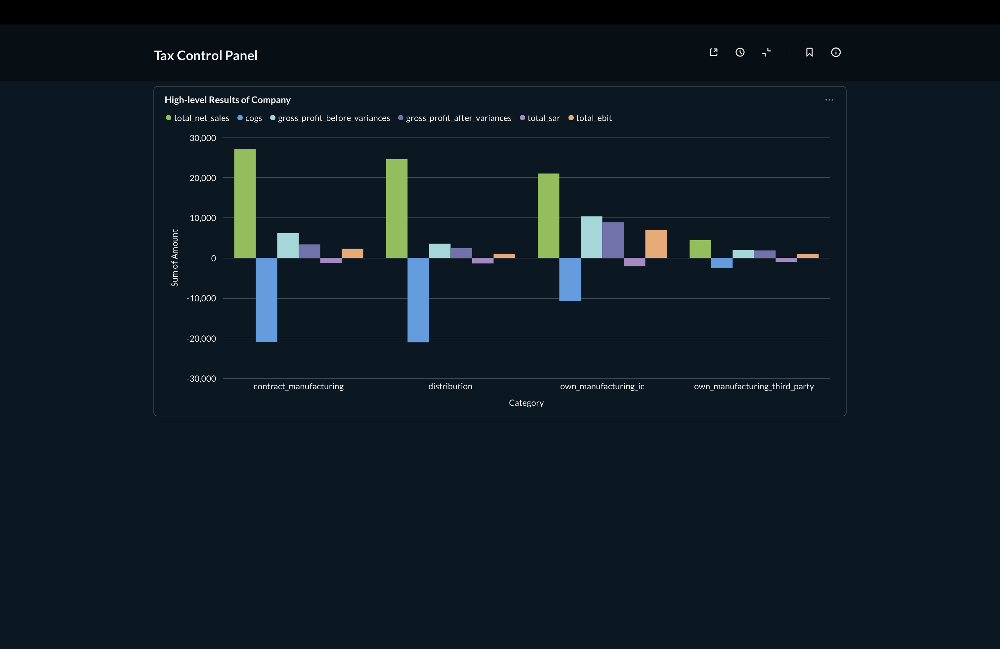

# Taxflow

## Overview
Taxflow is an ETL application for segmenting entities’ economic activities for
compliance purposes; in other words, ensuring that a company trades accordingly
to the arm's length principle. It reads source files, applies segmentation
rules, and can load results into a local SQLite database. The resulting database
can be plugged into Metabase for analysis on a dashboard.

## Example Dashboard

[Metabase](https://www.metabase.com) is an open-source business intelligence
tool that allows you to create interactive dashboards and reports from your
data. Taxflow is tailored to build beautiful and insightful dashboards for your
company's economic activities on Metabase; all while collating data from
multiple sources.



## Install
Taxflow uses a Python 3.13+ environment. Install dependencies with your preferred tool:

- Using `uv` (see `justfile`):
  - `just install`

- Using `pip`:
  - `pip install -e .`

## Usage
The CLI entry point is `taxflow` (see `app.cli:main`), with two subcommands:

- Run for all configured companies:
  - `taxflow all`
  - `taxflow all --load-db` (also loads results into the database)

- Run for a subset of companies:
  - `taxflow subset AB01 BE02`
  - `taxflow subset AB01 BE02 --load-db`

If you use `just`, the `justfile` provides:
- `just run-all -- --load-db`
- `just run subset AB01 BE02 -- --load-db`

## Config
Taxflow reads configuration from these locations:

- `config.yaml`  
  General app settings and data sources.
- `segmentation_config.yaml`  
  Pipeline and company configuration.
- `segments.csv`  
  Segment rules used to enhance OTP data.

### Examples

The below is relevant to a particular dataset; it should be used a rough
guidence how the tool operates and the kind of flexibility it accommodates.

`config.yaml`:
```yaml
pipeline: {}
debug: true
data_sources:
  # requires all datasets available to clean all data before the load and downstream analysis
  shared_services:
    shared_services_local_income: { fpath: "path/to/shared_services_local_income.xlsx", sheet_name: "Sheet1" }
    shared_services_local_expense: { fpath: "path/to/shared_services_local_expense.xlsx", sheet_name: "Sheet1" }
    shared_services_global_income: { fpath: "path/to/shared_services_global_income.xlsx", sheet_name: "Sheet1" }
    shared_services_global_expense: { fpath: "path/to/shared_services_global_expense.xlsx", sheet_name: "Sheet1" }
  isolated_pnl_segmentation: { fpath: "path/to/isolated_pnl_segmentation.xlsx", sheet_name: "Sheet1" }
  grand_total: { fpath: "path/to/grand_total.xlsx", sheet_name: "Sheet1" }
  intellectual_property:
    fpath: "path/to/intellectual_property.xlsx"
    sheet_name: "Sheet1"
    accounts_in_scope: ["10"]
  shared_services_total_charges:
    fpath: "path/to/shared_services_total_charges.xlsx"
    sheet_name: "Sheet1"
    accounts_in_scope: ["11"]
  rnd_services:
    # due to data fragmentation, we need to specify isolated pipelines for certain entities
    - company_code: "ACME"
      fpath: "path/to/rnd.xlsx"
      sheet_name: "Sheet1"
      accounts_in_scope: [1, 2, 3] # accounts in scope
database_path: "local/app.db" # database file path
log_level: "INFO" # INFO, DEBUG, WARNING, ERROR, CRITICAL
log_to_console: true # true or false
```

`segmentation_config.yaml`:
```yaml
# specifies pipeline configuration; certain entities may follow a different set of segmentation logic
pipeline:
  mixed_activity: ["ACME"]
  mixed_activity_with_external_costs: ["BCME"]
  single_activity: ["CCME"]
  manual_erosion_entities: ["DCME"]

# company-specific configuration
company_configs:
  - company_code: "ACME"
    external_costs_business_units: ["BU1", "BU2"]
    target_ebit_erosion: 0.05
```

`segments.csv`:

A simple mapping table to match features and enhance with the activity and category columns.

```csv
company_code,segment,activity,category
AB01,DIS,routine,distribution
AB02,OM,entrepreneur,own_manufacturing_third_party
```

## Tests
Run the test suite with:

- `pytest`
- Or, via `just`:
  - `just test`

## Metabase
When you run with `--load-db`, results are stored in `./local/app.db` by default. You
can connect this SQLite database to Metabase to build analysis dashboards.

Leverage `just dashboard` to generate a Metabase container; the sqlite database is accesible in `app/data` directory within the instance.
